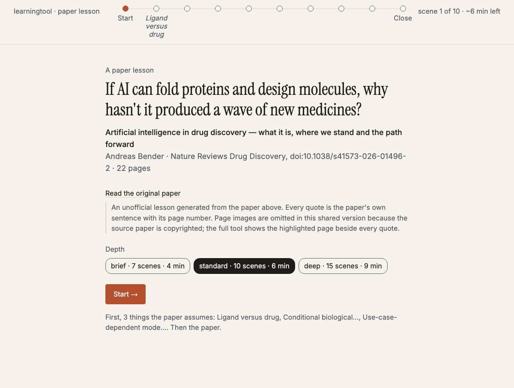
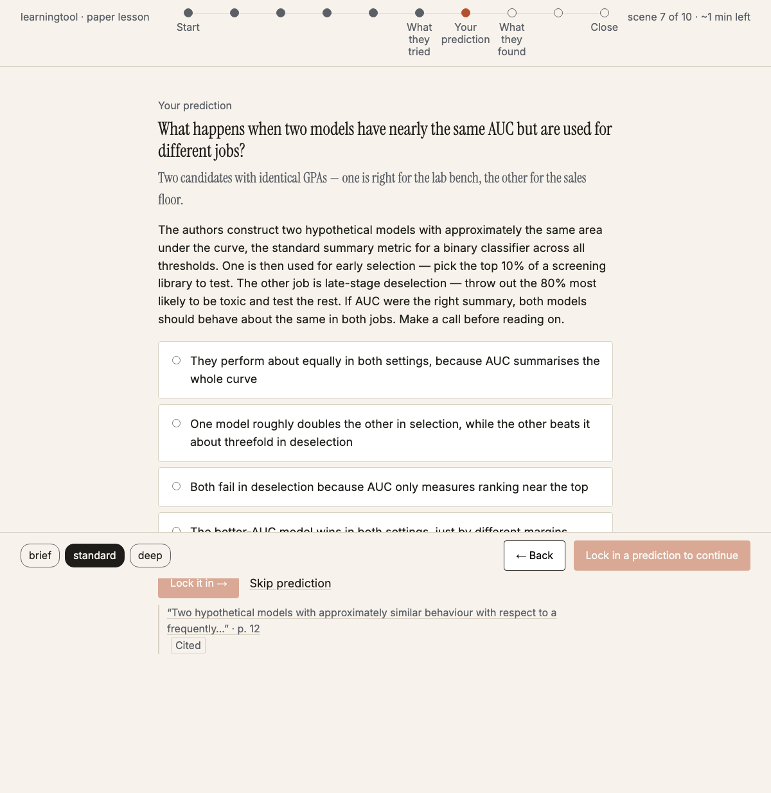
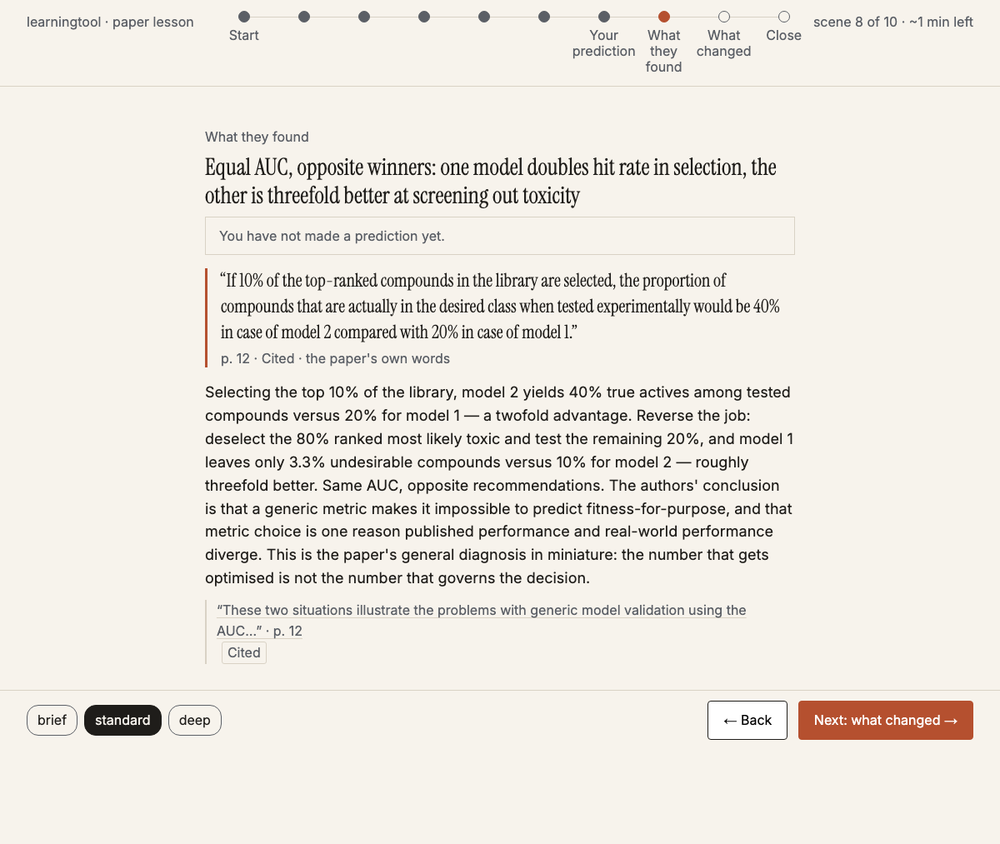

# learningtool

**Research papers: making academic fun!**

I built this tool because I love reading and story telling, and I also love reading scientific papers, but I felt there was a big gap in the entertainment aspect. Academic papers are usually very dense and hard to digest for someone that might not be a subject-matter-expert in the content. As someone that likes to get smart on complicated things fast, I want to be able to understand the content from academic papers without spending hours deciphering the meaning. I used G-stack to build a tool that reshapes a research paper into a story-like, interactive lessons: the concepts the paper assumes, the problem, what they tried, what they found and what changed. Every finding points at the paper's own sentence so it stays rooted in the facts. This is one of my attempts to make learning more fun and accessible :) 

### [▶ Live demo: two real lessons](https://ellabellae.github.io/learningtool/)

No install needed. Open a lesson, pick a depth, lock in a prediction, and click any quote to see
where in the paper it came from.

| Opens with a question, above the paper's real title | You guess the result before the paper answers | The answer arrives as the paper's own sentence |
|---|---|---|
|  |  |  |

## Why it's different from a summarizer

- **A lesson, not a summary.** Prerequisite rungs first (chosen from what *you* already know), then
  the paper as a plot with a prediction before the reveal. Guessing first is retrieval practice, the
  learning technique with the strongest evidence behind it.
- **The model never writes a quote.** It points at extracted sentences by id. A deterministic
  checker then confirms every finding cites real sentences and that every number in it appears
  there. Status reads **Cited**, never "verified", because that is what was actually proven.
- **A second pass checks meaning.** A flag-only audit reads each claim beside its cited sentences
  and can reject it; failed claims are removed from the lesson and named in an amber strip.
- **Sliders are honest.** Interactive models come from a reviewed template library (the model picks
  and configures; it never writes code), are labeled *illustrative*, and must cite the sentence
  describing the mechanism. If no template fits the paper, the lesson has no slider.
- **It remembers what you've read.** Concepts from lessons you've opened tie forward into new ones.

## How it works

```
 PDF ─▶ extract ─▶ generate ─▶ audit ─▶ check ─▶ (repair once) ─▶ render ─▶ lesson.html
        sentences   one LLM     meaning   rules    fix only what      one self-contained
        + page      call,       flags     1-8      failed, by id      file, opens anywhere
        boxes       JSON schema
```

Python pipeline, one Claude call per stage that needs a model, plain JSON files between stages,
vanilla JS player. 128 tests, including an end-to-end run on a synthetic two-column PDF.
The full design record, with every decision and the reviews that shaped it, is in
[docs/designs/papers-as-lessons.md](docs/designs/papers-as-lessons.md). Deferred work with triggers
is in [TODOS.md](TODOS.md).

## Run it yourself

Requirements: Python 3.12+, Node 20+, and an `ANTHROPIC_API_KEY` (a lesson costs roughly $0.15 to
$0.70 in API use depending on the model; reading lessons is free).

```bash
git clone https://github.com/ellabellae/learningtool && cd learningtool
python3 -m venv .venv && source .venv/bin/activate
pip install -e ".[dev]"
export ANTHROPIC_API_KEY=sk-ant-...
learn survey                       # a few questions about what you already know
learn lesson path/to/paper.pdf     # extract → generate → audit → check → render → open
```

```bash
learn list                         # papers, profiles, unread lessons
learn open <paper-id-prefix>       # reopen a lesson
learn share <id> [<id> ...]        # public versions (no page images) + index page in site/
```

Each stage is also its own command (`learn extract`, `generate`, `audit`, `check`, `repair`,
`render`). Settings: `LEARN_MODEL` (default `claude-opus-5`), `LEARN_EFFORT` (default `high`),
`LEARN_LLM_FAKE=replies.json` to replay canned replies for tests and demos.

## Tests

```bash
pytest                 # unit + end-to-end with a fake model
pytest -m eval         # real model calls; needs the API key
```

## A note on the papers

Your local lessons show a highlighted crop of the paper's page beside every quote. Shared lessons
omit those page images because the source papers are copyrighted; quotes remain as short attributed
sentences with page numbers and a link to the original. Extracted papers and your reading history
(`data/papers/`, `data/memory/`) are never committed. Lessons are unofficial and not affiliated with
or endorsed by the papers' authors or publishers.
